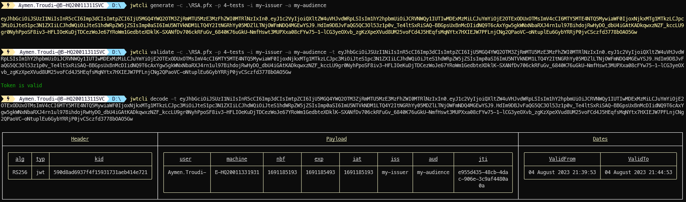

[](https://github.com/aimenux/JwtCli/actions/workflows/ci.yml)
[](https://www.nuget.org/packages/JwtCli/)
[](https://sonarcloud.io/summary/new_code?id=JwtCli-Key)

# JwtCli
```
Providing a net global tool to decode/generate/validate jwt tokens
```

> In this repo, i m building a global tool that allows to decode, generate and validate JWT tokens signed with an RSA/ECC certificate.
>
> The tool is based on multiple sub commands :
> - Use sub command `Decode` to decode jwt tokens
> - Use sub command `Generate` to generate jwt tokens
> - Use sub command `Validate` to validate jwt tokens

>
> To run the tool, type commands :
> - `JwtCli -h` to show help
> - `JwtCli -v` to show version
> - `JwtCli -s` to show settings
> - `JwtCli Decode -t [token]` to decode jwt token
> - `JwtCli Generate -c [certificate] -p [password]` to generate jwt token
> - `JwtCli Validate -c [certificate] -p [password] -t [token]` to validate jwt token
>
>
> To install global tool from a local source path, type commands :
> - `dotnet tool install -g --configfile .\nugets\local.config JwtCli --version "*-*" --ignore-failed-sources`
>
> To install global tool from [nuget source](https://www.nuget.org/packages/JwtCli), type these command :
> - For stable version : `dotnet tool install -g JwtCli --ignore-failed-sources`
> - For prerelease version : `dotnet tool install -g JwtCli --version "*-*" --ignore-failed-sources`
>
> To uninstall global tool, type these command :
> - `dotnet tool uninstall -g JwtCli`
>
> 
> 
>

**`Tools`** : vs22, net 6.0/7.0/8.0, command-line, spectre-console, fluent-validation, xunit